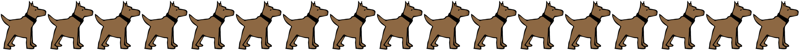

# Karel-Code-SHell
**A toy command line shell based off Bash.**<br/>
Made with minimal C experience, and originally on the CodeHS sandbox, hence the name!<br/>
<br/>
All required scripts contained in the root `karel` folder.<br/>
Type `'help'` for the list internally defined commands.<br/>
<br/>
Any reported bugs would be **greatly appreciated**.<br/>
This is a beginner project, and I'll be glad to increase my skills through improvement.<br/>
<br/>
<sub>A 'mens et manus' project</sub><br/>
Thanks to [Polecat and his 'feesh'](https://github.com/polecatttt/feesh) for help and inspiration!



## Installation
### Requirements
- **C compiler** (e.g. gcc, clang, or tcc)
- **POSIX** Environment (Linux, MacOS)
- Standard C headers (no external libraries)

<!-- -->

### Build
```console
$ cd karel
$ gcc -o kcsh main.c # if using gcc
$ tcc main.c -o kcsh # if using tcc
$ clang main.c -o kcsh # if using clang
```
> From the root folder of the downloaded release.

### Run
```console
$ ./kcsh
```
> If your compiler fails or warns about missing headers, please make sure you are on a POSIX compatible environment.<br/>
><br/>
> On Windows, try using WSL or MinGW, as native 32-bit and 64-bit Windows builds are not supported.

<!-- End Of Section -->

## Help
### List of internally defined commands
```
help - Shows a list of commands
cd [dir] - Goes to the specified directory
pwd - Prints the current working directory
rm [location] - Deletes the specified file or empty directory
touch [location] - Creates or updates file at specified directory
rd [location] - Reads specified file
mkdir [dir] - Creates specified directory
whoami - Prints the current user
echo [args] - Prints the specified arguments
conf [set / prt] [setting] [val (if 'set')] - Used to view or edit values of settings in 'kcsh.json'
```
